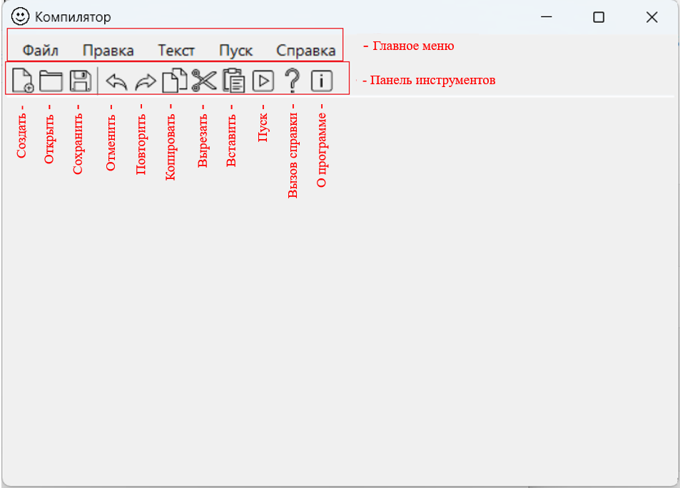
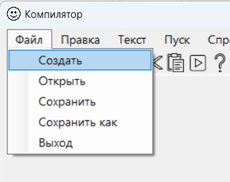
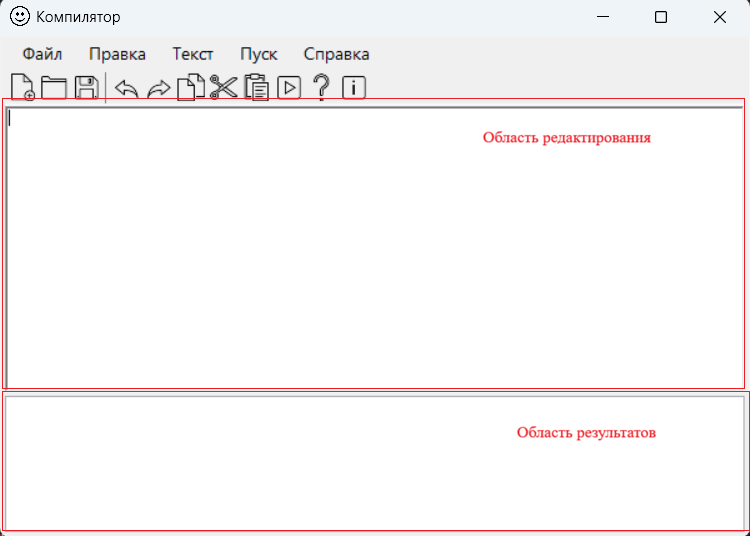
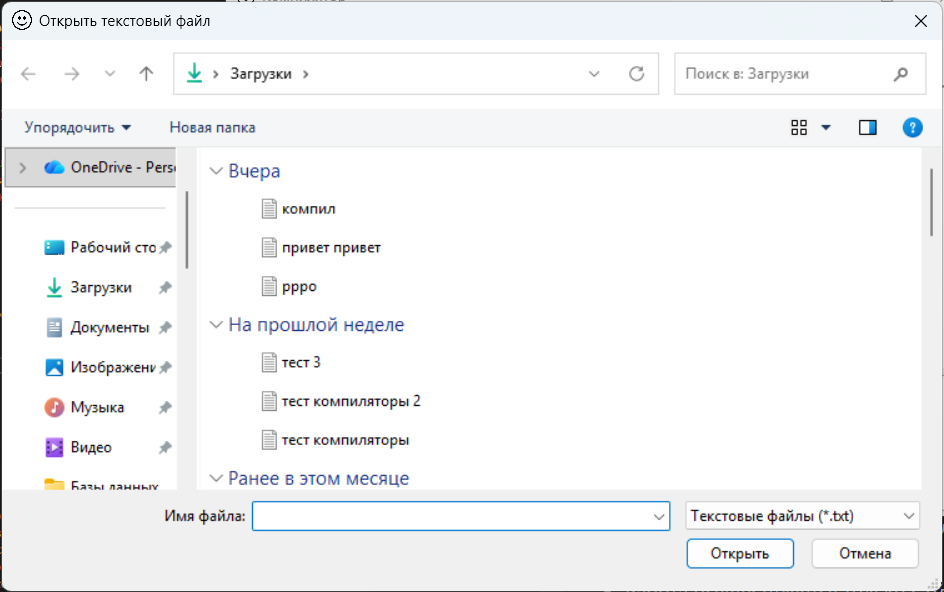
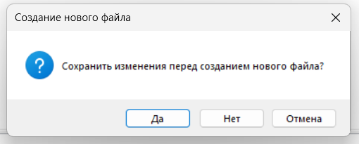
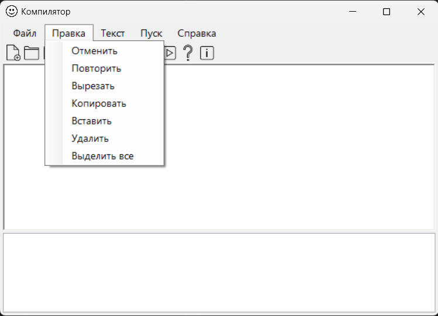
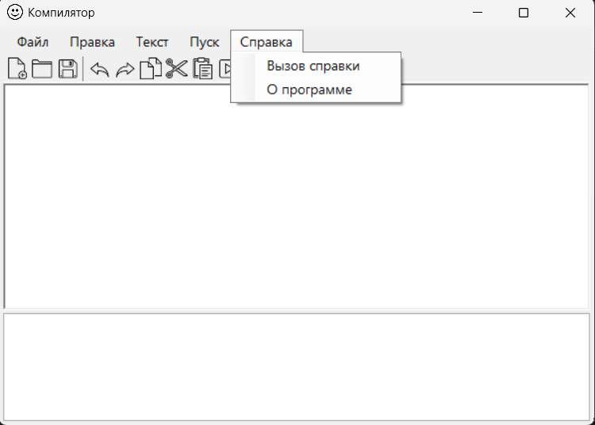

# Лабораторная работа №1

## Разработка пользовательского интерфейса (GUI) для языкового процессора
### Цель лабораторной работы

>Создание кроссплатформенного графического интерфейса (GUI) для языкового процессора в виде специализированного текстового редактора.

_Автор:_ Комиссарова Юлия\
_Группа:_ АП-326\
_Дисциплина:_ Теория формальных языков и компиляторов\
_Год:_ 2026

### Описание проекта

>Приложение представляет собой текстовый редактор с графическим интерфейсом пользователя.

__Программа позволяет:__

- создавать новые текстовые файлы;
- открывать существующие файлы формата .txt;
- редактировать текст;
- сохранять файл;
- сохранять файл под новым именем;
- выполнять операции редактирования (копирование, вставка, вырезание, отмена, повтор);
- получать справочную информацию о программе.

>Приложение построено с использованием технологии Windows Forms и предназначено для работы в операционной системе Windows.

### Используемые технологии

- Язык программирования: C#
- Платформа: .NET 7
- Фреймворк GUI: Windows Forms (WinForms)
- Среда разработки: Visual Studio
- Тип приложения: Desktop (Windows)

### Инструкция по сборке и запуску:

__Запуск готовой версии приложения__\
Для запуска готовой версии программы установка дополнительного программного обеспечения не требуется
- Перейдите в раздел Releases репозитория на GitHub и скачайте архив с последней версией программы
- Распакуйте содержимое архива в любую удобную папку на компьютере
- Откройте файл TextRed_lab1.zip двойным щелчком мыши - приложение запустится

__Сборка проекта из исходного кода__

- Установите .NET 7.0 SDK (если он ещё не установлен).
- Склонируйте репозиторий на локальный компьютер командой:
	>git clone <URL_репозитория>

- Выполните сборку проекта в режиме Release:
	>dotnet build -c Release

- После завершения сборки перейдите в каталог с созданным исполняемым файлом:
	>cd bin\Release\net7.0\

- Запустите приложение командой:
	>TextRed_lab1.exe

### Описание интерфейса и функций (руководство пользователя)
При запускке приложения открывается основное окно, на котором есть меню и панель инструментов

#### МЕНЮ "ФАЙЛ"

Вкладки меню "Файл"\

>Меню → Файл → Создать

\
_Создаёт новый документ, предлагает сохранить изменения при необходимости._

>Меню → Файл → Открыть

\
_Открывает .txt файл и добавлят содержимое в область редактирования._ 

>Меню → Файл → Сохранить

_Сохраняет текущий документ в формате .txt._

>Меню → Файл → Сохранить как

_Сохраняет файл под новым именем._

>Меню → Файл → Выход

_Если пользователь не редактировал текст или все изменения были сохранены, программа сразу закрывается.\
Если пользователь изменил текст и не выполнил сохранение, появляется диалоговое окно:_\

#### МЕНЮ "ПРАВКА"
Вкладки меню "Правка"\

>Меню → Файл → Отменить

Отменяет последнее выполненное действие в текстовом редакторе.

>Меню → Файл → Повторить

Повторяет последнее отменённое действие

>Меню → Файл → Вырезать

Удаляет выделенный фрагмент текста и помещает его в буфер обмена

>Меню → Файл → Копировать

Копирует выделенный текст в буфер обмена без удаления из документа.

>Меню → Файл → Вставить

Вставляет содержимое буфера обмена в текущую позицию курсора.

>Меню → Файл → Удалить

Удаляет выделенный фрагмент текста без сохранения его в буфер обмена.

>Меню → Файл → Выделить все

Выделяет весь текст, находящийся в области редактирования.

#### МЕНЮ "СПРАВКА"
Вкладки меню "Справка"\

Вкладка "Вызов справки" содержит описание всех реализованных функций меню\
Вкладка "О программе" предназначена для отображения информации о текущем приложении.

### Ограничения
- Поддерживается только текстовый формат файлов .txt
- Приложение работает только в операционной системе Windows
- Меню «Текст» и команда «Пуск» еще не реализованы
- Работа осуществляется только с одним документом одновременно
