# Теория формальных языков и компиляторов
### Содержание
1. [Лабораторная работа 1. Разработка пользовательского интерфейса (GUI) для языкового процессора](#лабораторная-работа-1)
2. [Лабораторная работа 2. Разработка лексического анализатора (сканера)](#лабораторная-работа-2)
3. [Лабораторная работа 3. Разработка синтаксического анализатора (парсера)](#лабораторная-работа-3)
3. [Лабораторная работа 4. Реализация алгоритма поиска подстрок с помощью регулярных выражений](#лабораторная-работа-4)

_Автор:_ Комиссарова Юлия\
_Группа:_ АП-326\
_Дисциплина:_ Теория формальных языков и компиляторов\
_Год:_ 2026

## __Лабораторная работа 1__

### Разработка пользовательского интерфейса (GUI) для языкового процессора

### Цель работы:

>Создание кроссплатформенного графического интерфейса (GUI) для языкового процессора в виде специализированного текстового редактора.

### Описание проекта

>Приложение представляет собой текстовый редактор с графическим интерфейсом пользователя.

__Программа позволяет:__

- создавать новые текстовые файлы;
- открывать существующие файлы формата .txt;
- редактировать текст;
- сохранять файл;
- сохранять файл под новым именем;
- выполнять операции редактирования (копирование, вставка, вырезание, отмена, повтор);
- получать справочную информацию о программе.

>Приложение построено с использованием технологии Windows Forms и предназначено для работы в операционной системе Windows.

### Используемые технологии

- Язык программирования: C#
- Платформа: .NET 7
- Фреймворк GUI: Windows Forms (WinForms)
- Среда разработки: Visual Studio
- Тип приложения: Desktop (Windows)

### Инструкция по сборке и запуску:

__Запуск готовой версии приложения__\
Для запуска готовой версии программы установка дополнительного программного обеспечения не требуется
- Перейдите в раздел Releases репозитория на GitHub и скачайте архив с последней версией программы
- Распакуйте содержимое архива в любую удобную папку на компьютере
- Откройте файл TextRed_lab1.zip двойным щелчком мыши - приложение запустится

__Сборка проекта из исходного кода__

- Установите .NET 7.0 SDK (если он ещё не установлен).
- Склонируйте репозиторий на локальный компьютер командой:
	>git clone <URL_репозитория>

- Выполните сборку проекта в режиме Release:
	>dotnet build -c Release

- После завершения сборки перейдите в каталог с созданным исполняемым файлом:
	>cd bin\Release\net7.0\

- Запустите приложение командой:
	>TextRed_lab1.exe

### Описание интерфейса и функций (руководство пользователя)
При запускке приложения открывается основное окно, на котором есть меню и панель инструментов

#### МЕНЮ "ФАЙЛ"

Вкладки меню "Файл"\

>Меню → Файл → Создать

\
_Создаёт новый документ, предлагает сохранить изменения при необходимости._

>Меню → Файл → Открыть

\
_Открывает .txt файл и добавлят содержимое в область редактирования._ 

>Меню → Файл → Сохранить

_Сохраняет текущий документ в формате .txt._

>Меню → Файл → Сохранить как

_Сохраняет файл под новым именем._

>Меню → Файл → Выход

_Если пользователь не редактировал текст или все изменения были сохранены, программа сразу закрывается.\
Если пользователь изменил текст и не выполнил сохранение, появляется диалоговое окно:_\

#### МЕНЮ "ПРАВКА"
Вкладки меню "Правка"\

>Меню → Файл → Отменить

Отменяет последнее выполненное действие в текстовом редакторе.

>Меню → Файл → Повторить

Повторяет последнее отменённое действие

>Меню → Файл → Вырезать

Удаляет выделенный фрагмент текста и помещает его в буфер обмена

>Меню → Файл → Копировать

Копирует выделенный текст в буфер обмена без удаления из документа.

>Меню → Файл → Вставить

Вставляет содержимое буфера обмена в текущую позицию курсора.

>Меню → Файл → Удалить

Удаляет выделенный фрагмент текста без сохранения его в буфер обмена.

>Меню → Файл → Выделить все

Выделяет весь текст, находящийся в области редактирования.

#### МЕНЮ "СПРАВКА"
Вкладки меню "Справка"\

Вкладка "Вызов справки" содержит описание всех реализованных функций меню\
Вкладка "О программе" предназначена для отображения информации о текущем приложении.

### Ограничения
- Поддерживается только текстовый формат файлов .txt
- Приложение работает только в операционной системе Windows
- Меню «Текст» и команда «Пуск» еще не реализованы
- Работа осуществляется только с одним документом одновременно

## Лабораторная работа 2

### Разработка лексического анализатора (сканера)
### Цель лабораторной работы

>Изучить назначение и принципы работы лексического анализатора в структуре компилятора. Спроектировать алгоритм (диаграмму состояний) и выполнить программную реализацию сканера для выделения лексем из входного текста. Интегрировать разработанный модуль в ранее созданный графический интерфейс языкового процессора.

### Постановка задачи:
>Лексический анализатор (сканер) выполняет первый этап компиляции. Его задача заключается в том, чтобы преобразовать исходный текст программы в последовательность лексем (токенов).

В рамках работы необходимо:

- спроектировать конечный автомат, реализующий процесс лексического анализа;
- разработать программный модуль сканера, который:\
    -принимает на вход текст программы;
    -разбивает текст на лексемы;\
    -определяет тип каждой лексемы;\
    -фиксирует позицию лексемы в исходном тексте;\
    -обнаруживает лексические ошибки (недопустимые символы);

- интегрировать разработанный сканер в графический интерфейс языкового процессора, созданный в лабораторной работе №1;
- вывести результаты анализа в виде таблицы
- реализовать навигацию по ошибкам, при которой при выборе ошибки в таблице курсор редактора перемещается к соответствующему символу

### Вариант задания: 
Вариант __№20__

Объявление словаря с инициализацией на языке Python

Формат записи:

>ИмяСловаря = {ключ: значение, ключ: значение, ...};

Словарь представляет собой набор пар ключ-значение, заключённых в фигурные скобки.

Пример конструкции:

>Dict = {1: 'Geeks', 2: 'For', 3: 'Geeks'};

__Примеры корректных входных строк:__

Пример 1

   > Dict = {1: 'AAA', 2: 'bbb'};

Пример 2
>Scores = {1: 100, 2: 95, 3: 87};

__Допустимые лексемы__
1. Идентификатор
2. Разделитель (пробел)	
3. Оператор присваивания ( = )
4. Открывающая фигурная скобка ( { )
5. Целое число ( 1, 2, 3 )
6. Число с плавающей точкой (12.5)
7. Строка в одинарных кавычках ('ааа')
8. Строка в двойных кавычках ("ааа")
9. Разделитель - двоеточие ( : )
10. Разделитель - запятая ( , )
11. Закрывающая фигурная скобка	( } )
12. Конец оператора ( ; )

>_Любой символ, не относящийся к указанным типам, считается лексической ошибкой._

### Диаграмма состояний
Изображение спроектированного конечного автомата: 
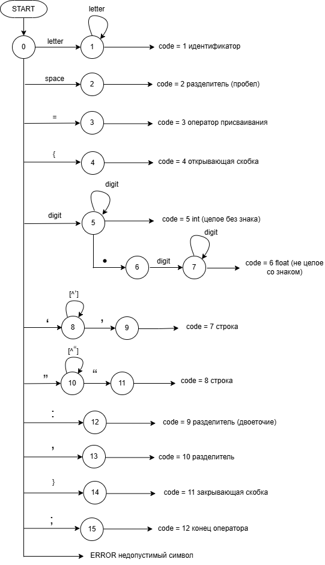

__Описание работы автомата:__

Лексический анализатор реализован в виде конечного автомата, который последовательно считывает символы входного текста и определяет тип каждой лексемы.
- Работа автомата начинается из состояния START. В этом состоянии анализируется текущий символ входной строки и выбирается соответствующий переход.
- Если первый символ является буквой, автомат переходит в состояние 1, где происходит распознавание идентификатора. В этом состоянии допускается последовательность букв, формирующая имя переменной или словаря.
- Если встречается пробел, автомат переходит в состояние 2, которое соответствует разделителю (пробелу).
- При обнаружении символа = автомат переходит в состояние 3, соответствующее оператору присваивания.
- Символ { переводит автомат в состояние 4, которое обозначает начало словаря.
- Если входной символ является цифрой, автомат переходит в состояние 5, где распознаётся целое число.
- Если после цифр встречается символ ., автомат переходит в состояние 6, после чего в состояние 7, где распознаётся число с плавающей точкой.
- При встрече одинарной кавычки ' автомат переходит в состояние 8, где считываются символы строки до закрывающей кавычки. После её обнаружения автомат завершает распознавание строковой лексемы.
- При встрече двойной кавычки " автомат переходит в состояние 10, где аналогично происходит считывание строки до закрывающей кавычки.
- Если встречается символ :, автомат переходит в состояние 12, соответствующее разделителю двоеточию.
- Если встречается , (запятая), автомат переходит в состояние 13, обозначающее разделитель между элементами словаря.
- Символ } переводит автомат в состояние 14, которое соответствует закрывающей фигурной скобке словаря.
- Символ ; переводит автомат в состояние 15, обозначающее конец оператора.
- Если входной символ не соответствует ни одному допустимому переходу, автомат переходит в состояние ERROR, что означает обнаружение недопустимого символа.

### Тестовые примеры:

Пример 1. Корректная строка\
Вход: scores = {1: 100};\
Выход:

| № | Тип                     | Лексема | Позиция        |
|---|-------------------------|---------|----------------|
| 1 | Идентификатор           | scores   | строка 1: 1-5  |
| 2 | Пробел                  |         | строка 1: 6-6  |
| 3 | Оператор присваивания   | =       | строка 1: 7-7  |
| 2 | Пробел                  |         | строка 1: 8-8  |
| 4 | Открывающая скобка      | {       | строка 1: 9-9  |
| 5 | Целое число             | 1       | строка 1: 10-10|
| 9 | Двоеточие               | :       | строка 1: 11-11|
| 2 | Пробел                  |         | строка 1: 12-12|
| 5 | Целое число             | 100     | строка 1: 13-15|
|11 | Закрывающая скобка      | }       | строка 1: 16-16|
|12 | Конец оператора         | ;       | строка 1: 17-17|

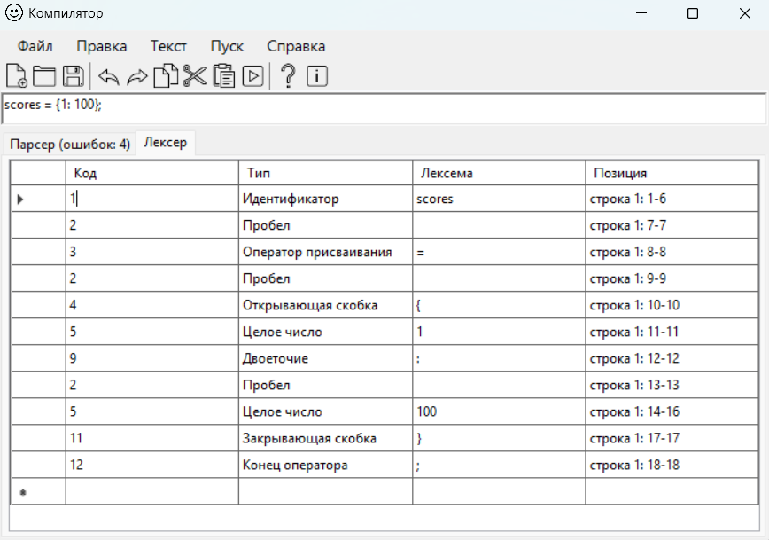

Пример 2. Строка с недопустимым символом\
Вход: aaa = {bbb: 10, @};\
Выход:

| Код  | Тип                     | Лексема | Позиция         |
|------|-------------------------|---------|-----------------|
| 1    | Идентификатор           | aaa     | строка 1: 1-3   |
| 2    | Пробел                  |         | строка 1: 4-4   |
| 3    | Оператор присваивания   | =       | строка 1: 5-5   |
| 2    | Пробел                  |         | строка 1: 6-6   |
| 4    | Открывающая скобка      | {       | строка 1: 7-7   |
| 1    | Идентификатор           | bbb     | строка 1: 8-10  |
| 9    | Двоеточие               | :       | строка 1: 11-11 |
| 2    | Пробел                  |         | строка 1: 12-12 |
| 5    | Целое число             | 10      | строка 1: 13-14 |
| 10   | Запятая                 | ,       | строка 1: 15-15 |
| 2    | Пробел                  |         | строка 1: 16-16 |
| ERROR| Недопустимый символ     | @       | строка 1: 17-17 |
| 11   | Закрывающая скобка      | }       | строка 1: 18-18 |
| 12   | Конец оператора         | ;       | строка 1: 19-19 |

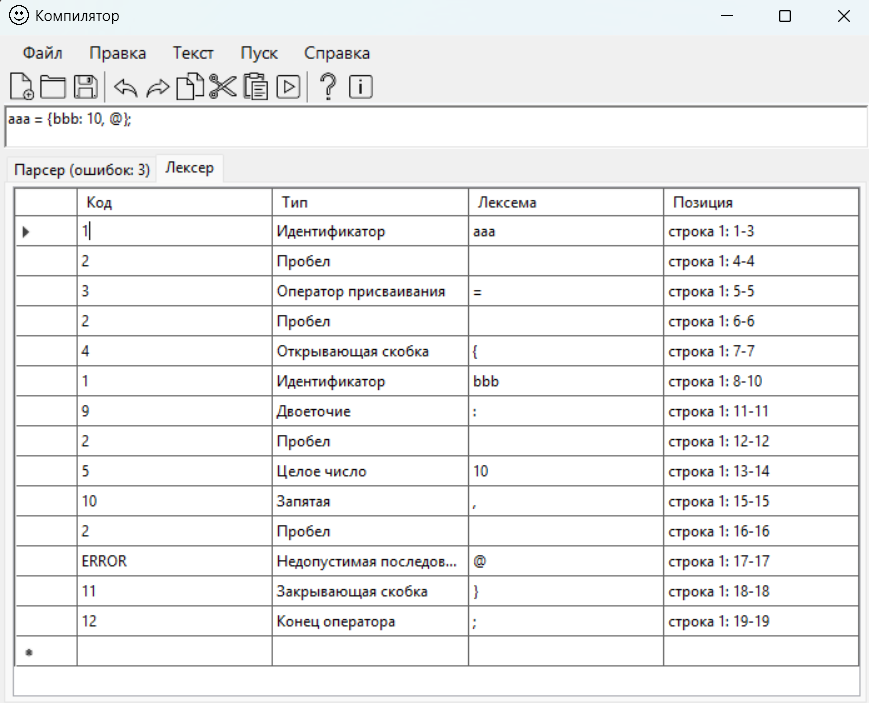

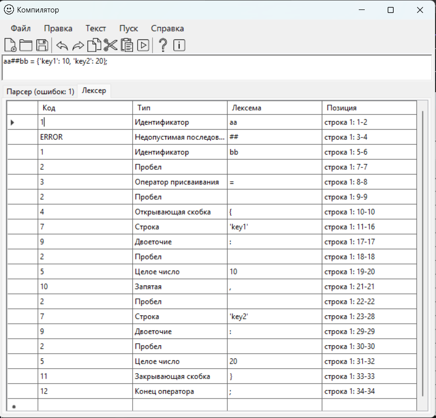

Пример 3. Многострочный пример\
Вход:\
d = {'key1': 10, 'key2': 20};\
e = {'a': 1};\
Выход:

| Код | Тип                     | Лексема | Позиция         |
|-----|-------------------------|---------|-----------------|
| 1   | Идентификатор           | d       | строка 1: 1-1   |
| 2   | Пробел                  |         | строка 1: 2-2   |
| 3   | Оператор присваивания   | =       | строка 1: 3-3   |
| 2   | Пробел                  |         | строка 1: 4-4   |
| 4   | Открывающая скобка      | {       | строка 1: 5-5   |
| 7   | Строка                  | 'key1'  | строка 1: 6-11  |
| 9   | Двоеточие               | :       | строка 1: 12-12 |
| 2   | Пробел                  |         | строка 1: 13-13 |
| 5   | Целое число             | 10      | строка 1: 14-15 |
| 10  | Запятая                 | ,       | строка 1: 16-16 |
| 2   | Пробел                  |         | строка 1: 17-17 |
| 7   | Строка                  | 'key2'  | строка 1: 18-23 |
| 9   | Двоеточие               | :       | строка 1: 24-24 |
| 2   | Пробел                  |         | строка 1: 25-25 |
| 5   | Целое число             | 20      | строка 1: 26-27 |
| 11  | Закрывающая скобка      | }       | строка 1: 28-28 |
| 12  | Конец оператора         | ;       | строка 1: 29-29 |
| 1   | Идентификатор           | e       | строка 2: 1-1   |
| 2   | Пробел                  |         | строка 2: 2-2   |
| 3   | Оператор присваивания   | =       | строка 2: 3-3   |
| 2   | Пробел                  |         | строка 2: 4-4   |
| 4   | Открывающая скобка      | {       | строка 2: 5-5   |
| 7   | Строка                  | 'a'     | строка 2: 6-8   |
| 9   | Двоеточие               | :       | строка 2: 9-9   |
| 2   | Пробел                  |         | строка 2: 10-10 |
| 5   | Целое число             | 1       | строка 2: 11-11 |
| 11  | Закрывающая скобка      | }       | строка 2: 12-12 |
| 12  | Конец оператора         | ;       | строка 2: 13-13 |

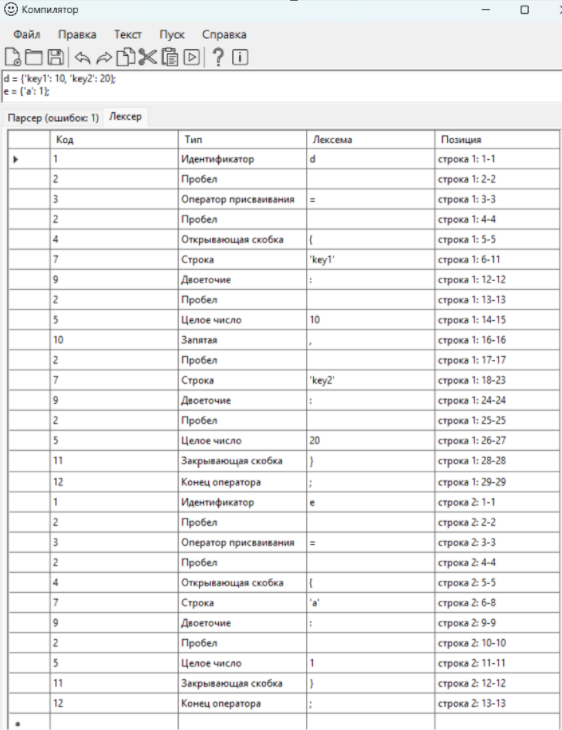

## Лабораторная работа №3

### Разработка синтаксического анализатора (парсера)
### Цель лабораторной работы

>Изучить назначение и принципы работы синтаксического анализатора в структуре компилятора. Спроектировать грамматику, построить соответствующую схему метода анализа грамматики и выполнить программную реализацию парсера с нейтрализацией синтаксических ошибок методом Айронса. Интегрировать разработанный модуль в ранее созданный графический интерфейс языкового процессора.

_Автор:_ Комиссарова Юлия\
_Группа:_ АП-326\
_Дисциплина:_ Теория формальных языков и компиляторов\
_Год:_ 2026

### Постановка задачи:
>Разработать синтаксический анализатор для заданной конструкции языка Python: объявление словаря с инициализацией. Парсер должен:

- Принимать на вход строку исходного кода (после лексического анализа).
- Проверять её синтаксическую корректность в соответствии с разработанной грамматикой.
- Обнаруживать синтаксические ошибки, продолжать анализ после ошибок (метод Айронса).
- Формировать таблицу ошибок с указанием фрагмента, местоположения (строка, позиция) и описания.
- Интегрироваться в существующее приложение, где уже реализован лексер и графический интерфейс (вкладки «Лексер» и «Парсер», навигация по ошибкам по клику)

### Вариант задания: 
Вариант __№20__

Объявление словаря с инициализацией на языке Python

Формат записи:

>ИмяСловаря = {ключ: значение, ключ: значение, ...};

Словарь представляет собой набор пар ключ-значение, заключённых в фигурные скобки.

Пример конструкции:

>Dict = {1: 'Geeks', 2: 'For', 3: 'Geeks'};

__Примеры корректных входных строк__

Пример 1
   > Dict = {1: 'AAA', 2: 'bbb'};

Пример 2
>Scores = {1: 100, 2: 95, 3: 87};

__Допустимые лексемы__
1. Идентификатор
2. Разделитель (пробел)	
3. Оператор присваивания ( = )
4. Открывающая фигурная скобка ( { )
5. Целое число ( 1, 2, 3 )
6. Число с плавающей точкой (12.5)
7. Строка в одинарных кавычках ('ааа')
8. Строка в двойных кавычках ("ааа")
9. Разделитель - двоеточие ( : )
10. Разделитель - запятая ( , )
11. Закрывающая фигурная скобка	( } )
12. Конец оператора ( ; )

### Разработка грамматики (полное определение разработанной грамматики).
Грамматика G[‹START›] для объявления словаря с инициализацией на языке Python:

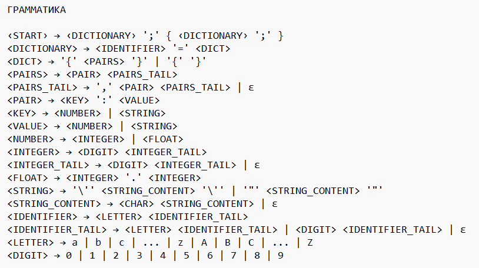

Следуя введенному формальному определению грамматики, представим G[‹START›] ее составляющими:
- Z = ‹START›;
- Vt = {a, b, c, …, z, A, B, C, …, Z, 0, 1, …, 9, =, {, }, :, ,, ;, ', ", .};
- Vn = {‹START›, ‹DICTIONARY›, ‹DICT›, ‹PAIRS›, ‹PAIRS_TAIL›, ‹PAIR›, ‹KEY›, ‹VALUE›, ‹NUMBER›, ‹INTEGER›, ‹INTEGER_TAIL›, ‹FLOAT›, ‹STRING›, ‹STRING_CONTENT›, ‹IDENTIFIER›, ‹IDENTIFIER_TAIL›, ‹LETTER›, ‹DIGIT›}.

### Классификация грамматики (по Хомскому).
Согласно классификации Хомского, разработанная грамматика G[‹START›] относится к контекстно-свободным (КС-грамматикам). 

Данный вывод обосновывается следующими свойствами:

- Каждое правило имеет вид A → α, где A – одиночный нетерминал, α – произвольная цепочка терминалов и нетерминалов (включая пустую цепочку).
- В правилах присутствуют конструкции, содержащие несколько нетерминалов в правой части, например:
  ><PAIRS_TAIL> → ',' ‹PAIR› <PAIRS_TAIL> – здесь после терминала , следуют два нетерминала подряд.
- Правила ‹DICT› → '{' ‹PAIRS› '}' и ‹DICT› → '{' '}' содержат терминалы, между которыми расположен нетерминал (или их нет). 

### Метод анализа (алгоритм синтаксического анализа - граф автоматной грамматики или рекурсивный спуск).
Для синтаксического анализа выбран метод рекурсивного спуска – нисходящий разбор, при котором каждому нетерминалу грамматики ставится в соответствие функция, рекурсивно вызывающая другие функции в соответствии с правилами вывода. 

Схема метода реализована в виде набора взаимно рекурсивных функций, каждая из которых обрабатывает определённый нетерминал:

- ParseProgram – соответствует ‹START›. Обрабатывает последовательность объявлений, разделённых точкой с запятой. В цикле вызывает ParseAssignment и после успешного разбора требует наличие токена ;.
- ParseAssignment – соответствует ‹DICTIONARY›. Распознаёт идентификатор, знак равенства = и затем вызывает ParseDict для разбора правой части.
- ParseDict – соответствует ‹DICT›. Разбирает фигурные скобки: сначала проверяет наличие {, затем, если следующая лексема не }, вызывает ParsePairList для разбора списка пар, после чего ожидает }.
- ParsePairList – соответствует ‹PAIRS›. В цикле разбирает пары с помощью ParsePair и обрабатывает разделители (запятые), завершая разбор при встрече }.
- ParsePair – соответствует ‹PAIR›. Последовательно разбирает ключ (целое или строка), двоеточие : и значение (целое, вещественное или строка).

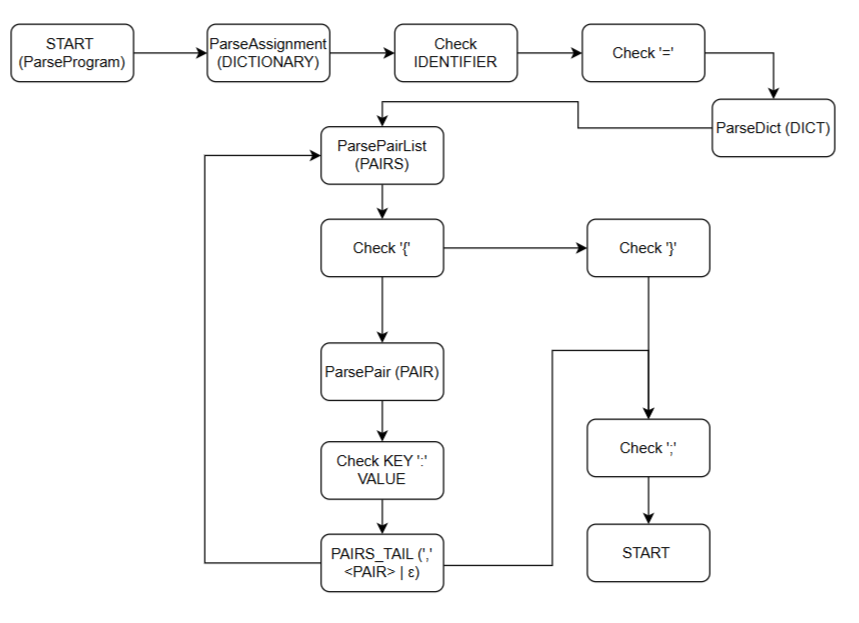

### Диагностика и нейтрализация синтаксических ошибок.
Согласно заданию, в синтаксическом анализаторе реализована нейтрализация синтаксических ошибок с использованием метода Айронса.
Метод Айронса позволяет продолжить анализ после обнаружения ошибки, удаляя из входной цепочки ошибочные символы и синхронизируясь с оставшейся частью. Алгоритм включает следующие шаги:
1. Выявление недостроенных кустов дерева разбора – определяются нетерминалы, разбор которых не был завершён к моменту ошибки.
2. Формирование множества остаточных символов – для каждого недостроенного куста вычисляются терминалы, которые могут следовать за текущей позицией.
3. Удаление символов из входного потока – пропускаются символы до тех пор, пока следующий символ не окажется допустимым для одного из недостроенных кустов.
4. Привязка оставшейся цепочки – определяется, к какому из недостроенных кустов можно присоединить оставшийся входной поток.

В результате анализатор не останавливается на первой ошибке, а продолжает работу, выявляя как можно больше ошибок.

__Реализация метода Айронса в разработанном парсере__

Парсер реализован методом рекурсивного спуска, и для восстановления после ошибок применяется упрощённая версия метода Айронса, основанная на синхронизирующих токенах. При обнаружении ошибки выполняются следующие действия:

Фиксация ошибки – в таблицу ошибок добавляется запись, содержащая:
- неверный фрагмент (лексему, вызвавшую ошибку);
- номер строки и позицию начала фрагмента;
- текстовое описание (например, «Ожидался идентификатор», «Ожидалось двоеточие»).

Синхронизация – анализатор пропускает токены до тех пор, пока не встретит один из заранее определённых для текущего контекста «синхронизирующих» токенов.

Продолжение разбора – после нахождения синхронизирующего токена разбор возобновляется с ближайшего возможного нетерминала.

### Тестовые примеры (скриншоты интерфейса программы, примеры анализа конкретных строк в программе).
Пример 1 - корректная строка
>Dict = {1: 'Geeks', 2: 'For', 3: 'Geeks'};

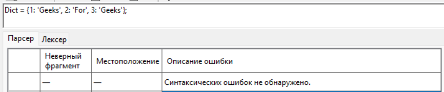

Пример 2 - строка с одной ошибкой
>Dict = {1: 'Geeks', 2 'For', 3: 'Geeks'};

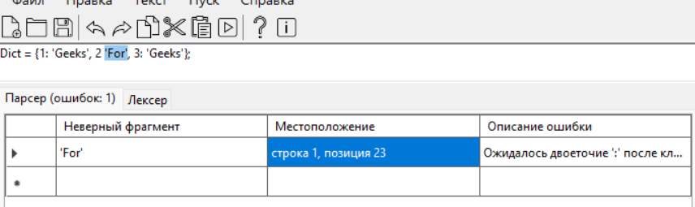

Пример 3 - строка с несколькими ошибками
>Dict = {1: 45 'Geeks', 2: 'For'3'Geeks'};

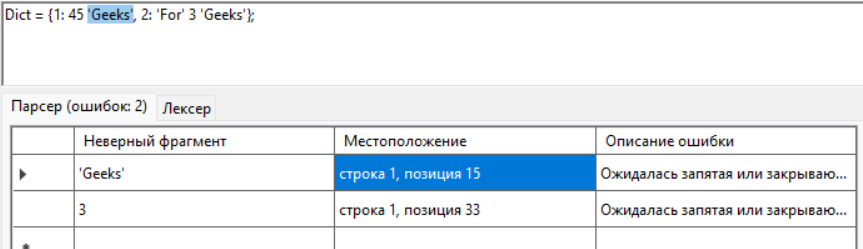

Пример 4 - пустая строка

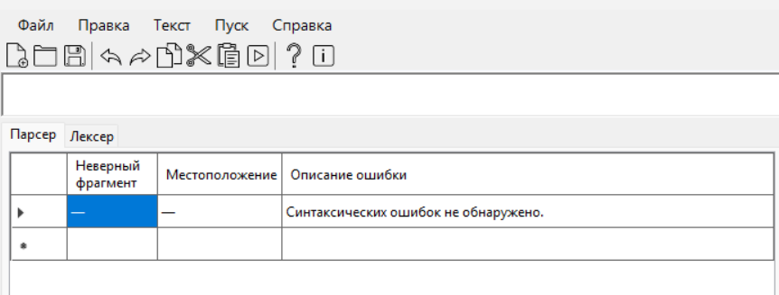

Пример 5 - строка без первого ключевого слова
>= {1: 'Geeks'};

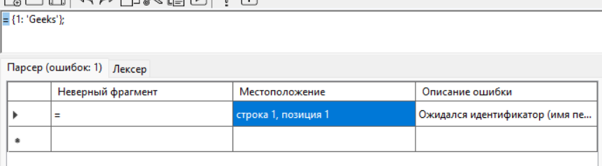

## Лабораторная работа 4

### Реализация алгоритма поиска подстрок с помощью регулярных выражений

### Цель лабораторной работы

>Цель работы
Изучить теоретические основы регулярных выражений и их применение для поиска и извлечения подстрок из текста. Освоить практические навыки использования библиотечных средств работы с регулярными выражениями, а также интеграцию алгоритмов поиска в графический интерфейс приложения.

_Автор:_ Комиссарова Юлия\
_Группа:_ АП-326\
_Дисциплина:_ Теория формальных языков и компиляторов\
_Год:_ 2026

### Постановка задачи:
>Разработать модуль поиска подстрок с использованием регулярных выражений, интегрировать его в существующее приложение (текстовый редактор) и обеспечить наглядный вывод результатов.

2.Построить РВ, описывающее канадские почтовые индексы.

8.Построить РВ, описывающее номера карт, принадлежащих платежной системе Maestro Card.

28.Построить РВ, описывающее все виды записей комплексных чисел.

### Решение 3 задач (регулярные выражения)

__Задача 2. Канадские почтовые индексы__
Описание задачи
>Необходимо найти в тексте все канадские почтовые индексы. Канадский почтовый индекс имеет формат: буква, цифра, буква, пробел (необязательно), цифра, буква, цифра. Примеры: K1A 0B1, T2S3H4. Регистр букв не важен.

Регулярное выражение с пояснением каждого обозначения:
>\b[A-Za-z]\d[A-Za-z] ?\d[A-Za-z]\d\b

- \b – граница слова; гарантирует, что индекс не является частью более длинного слова
- [A-Za-z] – одна латинская буква в любом регистре
- \d – одна цифра (0–9)
- [A-Za-z] – одна латинская буква
- ? – необязательный пробел (ноль или один пробел)
- \d – цифра
- [A-Za-z] – буква
- \d – цифра
- \b – завершающая граница слова

Примеры строк, которые должны находиться:
- K1A 0B1
- T2S3H4
- v6g2l8
- M5V 2T6

Примеры строк, которые не должны находиться
- K1A 0B
- 123 456
- A1B 2C3D
- K1A-0B1
- K1A0B1X

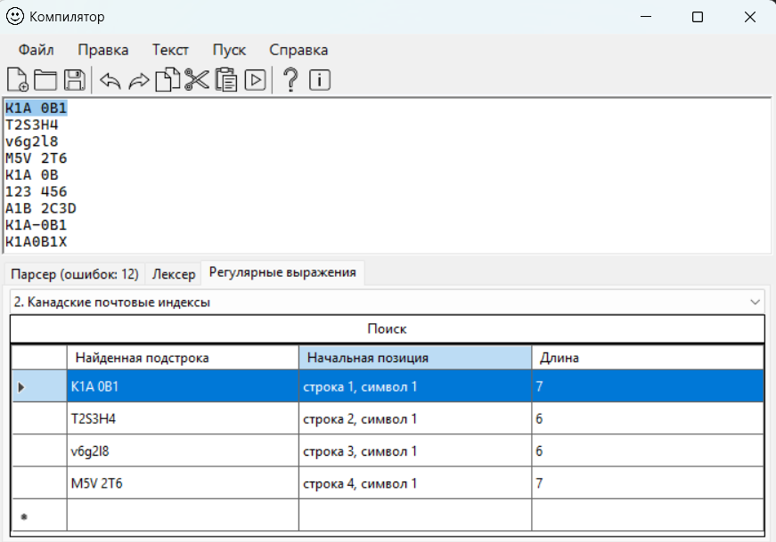

__Задача 8. Номера карт платёжной системы Maestro Card__
Описание задачи
>Из текста требуется извлечь номера банковских карт, принадлежащих системе Maestro. Maestro имеет начало: 50, 56–59, 60–69. Длина номера карты – от 18 до 21 цифры. В номере не допускаются пробелы или разделители

Регулярное выражение с пояснением каждого обозначения:
> \b(50|5[6-9]|6[0-9])[0-9]{16,19}\b
- \b – граница слова.
- (50|5[6-9]|6[0-9]) – начало:
- 50 – число 50,
- 5[6-9] – цифра 5, за которой следует цифра от 6 до 9 (56, 57, 58, 59),
- 6[0-9] – цифра 6, за которой следует любая цифра от 0 до 9 (60–69).
- [0-9]{16,19} – от 16 до 19 цифр (включительно). Общая длина номера: 2 (префикс) + от 16 до 19 = от 18 до 21 цифры.
- \b – граница слова.

Примеры строк, которые должны находиться
- 501234567890123456
- 569876543210987654321
- 60123456789012345678
- 58999999999999999999

Примеры строк, которые не должны находиться
- 5012345678901
- 55123456789012345678916481
- 4912345678901234
- 70 1234567890123456
- 5012-3456-7890-1234

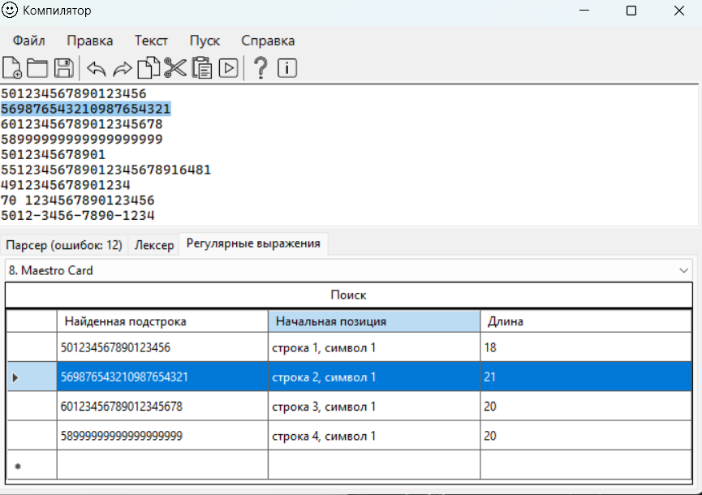

__Задача 28. Комплексные числа__

Описание задачи:

Необходимо распознать все записи комплексных чисел в тексте. Допустимые формы:

- Действительная + мнимая части: a+bi, a-bi (с возможными пробелами вокруг знака + или -)
- Только мнимая часть: bi (или bj, если используется j вместо i)
- Действительная и мнимая части могут быть целыми или вещественными (с десятичной точкой)
- Числа могут быть отрицательными

Регулярное выражение с пояснением каждого обозначения:
>-?\d+(?:\.\d+)?\s*[+-]\s*\d+(?:\.\d+)?[ij]|\b\d+(?:\.\d+)?[ij]\b

Первая часть (полная форма a+bi или a-bi):

- -? – необязательный знак минуса (отрицательное действительное число)
- \d+ – одна или более цифр (целая часть)
- (?:\.\d+)? – необязательная десятичная часть: точка, за которой следуют одна или более цифр. Группа (?: ) – незапоминающая.
- \s* – любое количество пробелов (включая ноль) перед знаком
- [+-] – знак плюс или минус
- \s* – любое количество пробелов после знака
- \d+(?:\.\d+)? – целая или вещественная часть мнимой компоненты (аналогично действительной)
- [ij] – мнимая единица: буква i или j.

Вторая вторая часть (только мнимая часть):
- \b – граница слова
- \d+(?:\.\d+)? – целое или вещественное число (коэффициент при мнимой единице)
- [ij] – мнимая единица
- \b – завершающая граница слова.

Примеры строк, которые должны находиться

- 3+4i
- -2.5 - 3j
- 7i
- -1.2j
- 0+0i
- 10.5+2.3i
- -5 - 0.7j

Примеры строк, которые не должны находиться

- 3+4
- i
- 2+3 
- 3i+2
- abc
- 3i2

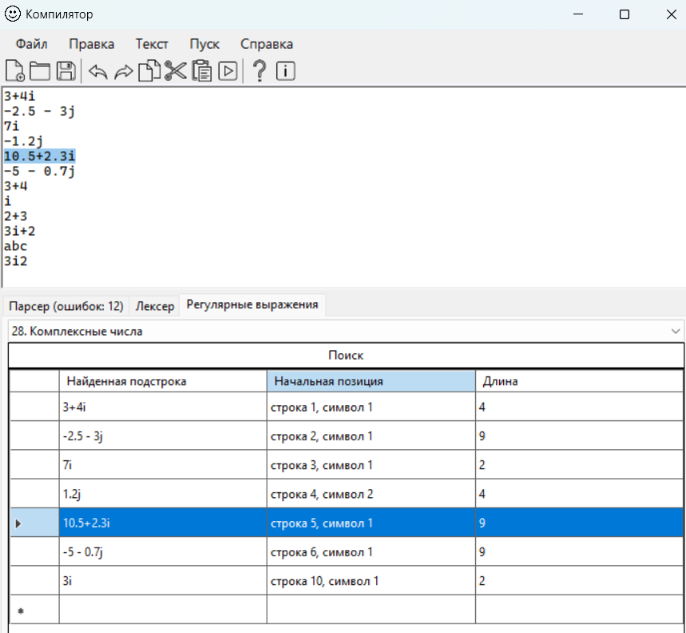

Скриншоты работы (доп.):

Возможность вывода количества найденных совпадений
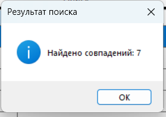

Отсутствие данных для поиска:
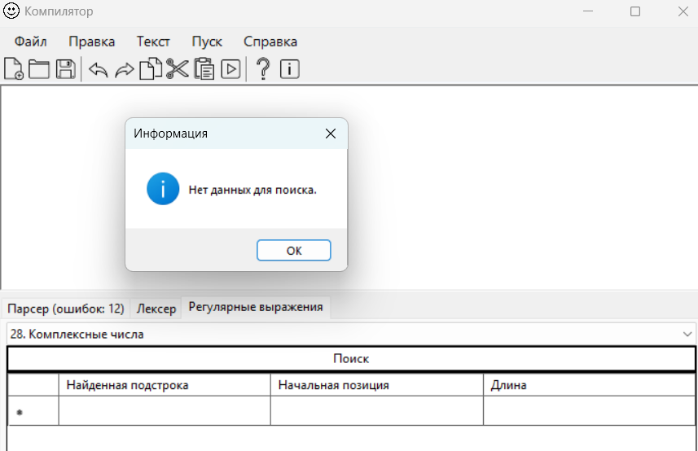